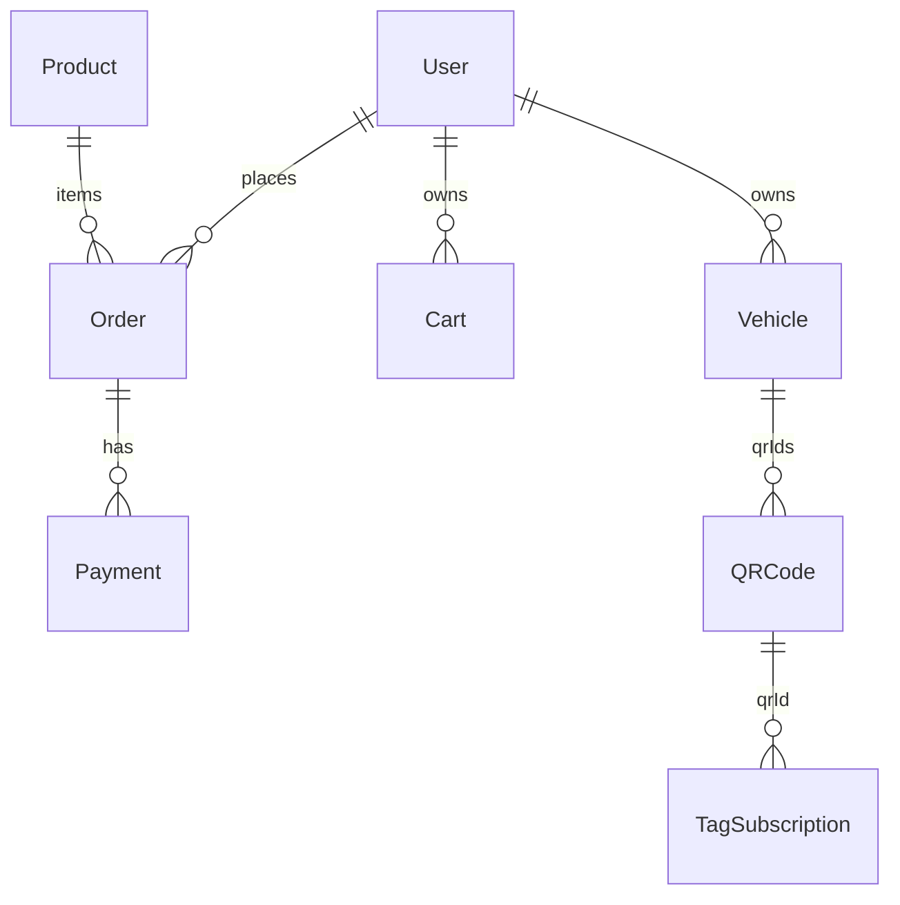

# scanzybd-server

Express 5 REST API for ScanzyBD. MongoDB via Mongoose. Deployed as Vercel serverless (`api/index.js`).

**Local default:** http://localhost:5000  
**API base:** `/api`

---

## Scripts

| Command | Description |
|---------|-------------|
| `npm run dev` | Nodemon → `src/index.js` (port `PORT` or 5000) |
| `npm start` | Production-style local server |
| `npm run vercel:dev` | Vercel dev (serverless simulation) |
| `npm run deploy:vercel` | `vercel --prod` |
| `npm run backfill:subscriptions` | Legacy order → subscription backfill CLI |

---

## Project structure

```
startup-server/
├── api/
│   └── index.js          # Vercel serverless handler (DB connect + Express)
├── src/
│   ├── app.js            # Express app, mounts all /api routers
│   ├── index.js          # Local dev: listen(PORT), GET /health
│   ├── config/
│   │   └── db.js         # MongoDB connection (URI fallbacks)
│   ├── routes/           # Route definitions (20 files)
│   ├── controllers/      # Request handlers (24 files)
│   ├── models/           # Mongoose schemas (22 collections)
│   ├── service/          # bKash, SSLCommerz, payment init, finance, QR frames
│   ├── utils/            # Cart/order validation, subscriptions, policies
│   └── middleware/       # auth, cors, rateLimit, apiResponseCache
├── scripts/
│   ├── backfill-order-subscriptions.mjs
│   └── test-brta.mjs
├── vercel.json           # Rewrites + crons
└── package.json
```

---

## Entry points

| File | When used |
|------|-----------|
| `api/index.js` | Vercel production — caches `connectDB()` in `globalThis.__qrTagDbReady` |
| `src/index.js` | `npm run dev` / `npm start` |
| `src/app.js` | Shared Express app imported by both |

---

## Environment variables

Copy `.env example` to `.env`. **Never commit real secrets.**

### Required

| Variable | Purpose |
|----------|---------|
| `MONGODB_URI` **or** `DB_USER` + `DB_PASS` | Database connection (`src/config/db.js`) |
| `JWT_SECRET` | Sign/verify app JWT (24h) |

### Auth & CORS

| Variable | Purpose |
|----------|---------|
| `FIREBASE_WEB_API_KEY` | Verify Google ID tokens (`POST /api/auth/social`) |
| `CLIENT_URL`, `FRONTEND_URL` | CORS allowlist + QR landing base URL |
| `CORS_ALLOWED_ORIGINS` | Extra comma-separated origins |

### Payments

| Variable | Purpose |
|----------|---------|
| `BKASH_*` | bKash tokenized checkout (`service/bkash.service.js`) |
| `SSLCOMMERZ_*`, `API_PUBLIC_URL` | SSLCommerz sessions and callbacks |

### Other

| Variable | Purpose |
|----------|---------|
| `PORT` | Local server port (default 5000) |
| `CRON_SECRET` | Authorize cron endpoints (`Authorization: Bearer` or `x-cron-secret`) |
| `CLOUDINARY_CLOUD_NAME` / `CLOUDINARY_API_KEY` / `CLOUDINARY_API_SECRET` | `POST /api/upload/image` (product & settings images) |
| `SMTP_*` | Password reset email (`utils/mailer.js`) |
| `API_CACHE_ENABLED`, `API_CACHE_TTL_MS`, `API_CACHE_MAX` | GET response LRU cache |
| `MONGODB_USE_SRV` | Try `mongodb+srv://` if direct URI fails |

---

## Global middleware (`src/app.js`)

1. `trust proxy` — for rate limit IP behind Vercel
2. CORS — `middleware/cors.js` (scanzybd.com, localhost, env origins)
3. `express.json({ limit: "12mb" })`
4. `globalApiRateLimit` — 250 req / 15 min per IP on `/api`
5. `installApiResponseCache` — LRU GET cache (skips payment callbacks)

---

## Authentication & authorization

**Middleware** (`src/middleware/auth.js`):

| Export | Behavior |
|--------|----------|
| `verifyToken` | Bearer JWT → `req.user` from DB; rejects disabled users |
| `optionalVerifyToken` | Sets `req.user` or null |
| `isAdmin` | `role === "admin"` |
| `isProvider` | `role === "provider"` |
| `isAdminOrProvider` | admin or provider |

**JWT payload:** `{ id, role }` — signed in `auth.controller.js`, expires **24h**.

**Rate limits** (`middleware/rateLimit.js`): login, register, forgot password, social login, order create, payment create, contact form. Payment callbacks and crons are excluded from global limit.

---

## API routes

Mount prefix: `/api`. Full paths below.

### `/api/auth`

| Method | Path | Auth | Notes |
|--------|------|------|-------|
| POST | `/register` | — | `{ name, email, password }` — password ≥ 6 |
| POST | `/login` | — | Returns `{ token, expiresAt, user }` |
| POST | `/social` | — | `{ idToken }` — requires verified email |
| POST | `/forgot-password` | — | |
| POST | `/verify-reset-code` | — | |
| POST | `/reset-password` | — | |
| GET | `/me` | JWT | |
| PATCH | `/me` | JWT | |

### `/api/cart`

| Method | Path | Auth | Notes |
|--------|------|------|-------|
| GET | `/` | JWT | Stale cart (7d) auto-deleted |
| PUT | `/` | JWT | `{ items }` — validated via `resolveOrderLineItems`; empty → delete |
| DELETE | `/` | JWT | Clear cart |
| GET | `/cron/purge-stale` | CRON_SECRET | Weekly purge |

### `/api/products`

| Method | Path | Auth |
|--------|------|------|
| GET | `/` | Public |
| GET | `/:id` | Public |
| POST | `/` | Admin |
| PUT | `/:id` | Admin |
| PATCH | `/reorder` | Admin |
| GET | `/mine` | Provider |
| GET | `/my/:email` | Admin/Provider |

### `/api/package`

| Method | Path | Auth |
|--------|------|------|
| GET | `/` | Optional JWT |
| POST | `/` | Admin |
| PUT | `/:id` | Admin |
| DELETE | `/:id` | Admin |

### `/api/order`

| Method | Path | Auth | Notes |
|--------|------|------|-------|
| POST | `/create` | JWT | User checkout — server computes `totalAmount` |
| POST | `/staff-create` | Admin/Provider | Staff order |
| GET | `/my-orders` | JWT | |
| DELETE | `/my-orders/:orderId` | JWT | Own unpaid (7d policy) |
| GET | `/staff-orders` | Admin/Provider | Main dashboard list |
| GET | `/:orderId` | JWT | |
| PATCH | `/:orderId/status` | Admin | |
| PATCH | `/:orderId/payment` | Admin | Manual payment + audit log |
| PATCH | `/:orderId/complete` | Admin | **No client caller found** |
| DELETE | `/:orderId` | Admin | |
| DELETE | `/bulk-unpaid` | Admin | |
| GET | `/dashboard-analytics` | Admin/Provider | |
| GET | `/cron/purge-abandoned` | CRON_SECRET | Daily |

Legacy provider list endpoints still exist: `GET /`, `/pending`, `/returned`, `/cancelled`, `/completed`, `/shipped`, `/delivered` — client mostly uses `staff-orders` instead.

**`POST /create` body:**

```json
{
  "cartItems": [{ "productId": "<id>", "quantity": 1 }],
  "tagAssignments": [],
  "shippingAddress": {
    "fullName": "",
    "phone": "",
    "line1": "",
    "line2": "",
    "union": "",
    "upazila": "",
    "city": "",
    "district": "",
    "postalCode": ""
  }
}
```

Required: `fullName`, `phone`, `union`, `upazila`, `city`.

### `/api/payment`

| Method | Path | Auth |
|--------|------|------|
| GET | `/gateways` | Public |
| GET | `/admin/gateways` | Admin |
| PATCH | `/admin/gateways` | Admin |
| POST | `/create` | JWT |
| POST | `/confirm` | JWT — status check only; does not complete payment |
| GET | `/my-payments` | JWT |
| GET | `/bkash/callback` | Public |
| POST/GET | `/sslcommerz/*` | Public callbacks |

### `/api/qr`

| Method | Path | Auth |
|--------|------|------|
| POST | `/generate` | Admin |
| GET | `/allQR` | Admin/Provider |
| GET | `/id/:id` | Admin/Provider |
| GET | `/code/:code` | Public |
| GET | `/:code` | Public scan |
| POST | `/assign`, `/unassign` | Admin/Provider |
| `/frames/*` | Mixed | QR sticker templates |

### `/api/vehicle`

`POST /add`, `GET /`, `GET /my`, `POST /update/:id`, `DELETE /delete/:id` — all JWT.

### `/api/subscription`

| Method | Path | Auth |
|--------|------|------|
| GET | `/my-tags` | JWT |
| POST | `/renew-intent` | JWT |

### `/api/finance`, `/api/users`, `/api/reviews`, `/api/contact`, `/api/expenses`, `/api/settings`, `/api/locations`, `/api/tag-types`, `/api/upload`

See route files in `src/routes/` for exact paths. Duplicate BRTA: `GET /api/brta-zones` and `GET /api/locations/brta-zones` (same controller).

---

## Database models

| Model | Collection purpose |
|-------|-------------------|
| `User` | Accounts — roles: admin, provider, user |
| `Product` | Catalog — price, validityDays, stock |
| `Package` | Homepage offers |
| `Cart` | Per-user cart (unique userId) |
| `Order` | Orders — orderNo from Counter |
| `Payment` | Gateway payments + admin audit |
| `QRCode` | Generated QR codes |
| `Vehicle` | Customer vehicles + qrIds |
| `TagSubscription` | Per-QR validity window |
| `Review`, `Contact`, `Expense` | CMS / inbox |
| `SettlementRequest`, `ProviderPaymentProfile` | Provider finance |
| `PaymentGatewaySettings`, `SocialMediaSettings` | Site config |
| `QrFrameTemplate` | QR sticker layouts |
| `TagType` | Vehicle tag types |
| `Location`, `BrtaZone`, `BrtaSeries` | Address/BRTA data (flexible schema) |
| `Counter` | Monotonic `order_no` |

**No migration runner** — schema changes are code-first in `src/models/`. Use `scripts/` for one-off backfills.

### Key relationships



---

## Core business logic

### `resolveOrderLineItems` (`utils/orderCartValidation.js`)

- Loads each `productId` from DB
- Rejects inactive/out-of-stock products
- Uses **DB price only** — ignores client-sent price/title for totals

### `processOrderPaid` (`utils/tagSubscription.service.js`)

Runs after successful payment:

- Updates order payment status
- Creates vehicles from `tagAssignments` (purchase)
- Creates/extends `TagSubscription` using product `validityDays`
- Handles renew order kinds: `renew_same_qr`, `renew_new_qr`

### Unpaid order policy (`utils/unpaidOrderPolicy.js`)

- `UNPAID_ORDER_EXPIRE_DAYS = 7`
- Purchase orders only for user/admin delete rules
- Cron: `purgeAbandonedUnpaidOrders`

### Cart policy (`utils/cartPolicy.js`)

- `CART_EXPIRE_DAYS = 7` — stale carts purged by cron

---

## Deployment (Vercel)

`vercel.json`:

- All requests rewritten to `/api` → `api/index.js`
- Function: 1024 MB, 60s max duration
- Crons: order purge (daily), cart purge (weekly)

Set all env vars in Vercel project settings. Ensure MongoDB Atlas allows Vercel egress IPs (or `0.0.0.0/0`).

```bash
npm run deploy:vercel
```

---

## Adding an endpoint

1. Add handler in `src/controllers/<domain>.controller.js`
2. Register in `src/routes/<domain>Routes.js` with correct middleware
3. If new domain: import and `app.use()` in `src/app.js`
4. For cart/order/money: use `resolveOrderLineItems` — never trust client prices
5. For GET lists: check if `apiResponseCache` should include the resource group

---

## Dead / unwired code (known)

| Item | Notes |
|------|-------|
| `updateOrderStatus` in `order.controller.js` | Exported, not in any route |
| `PATCH /api/order/:orderId/complete` | No client usage found |
| `ecosystem.config.cjs` | Referenced in package.json PM2 scripts — **not in repo** |

---

## Troubleshooting

| Issue | Action |
|-------|--------|
| 503 Database unavailable | Check `MONGODB_URI`, Atlas IP whitelist, Vercel logs |
| SyntaxError on deploy | `node --check src/controllers/<file>.js`; fix before push |
| CORS blocked | Add origin to `CLIENT_URL` or `CORS_ALLOWED_ORIGINS` |
| 429 Too many requests | See `rateLimit.js` thresholds |
| Cron not running | Vercel cron + `CRON_SECRET` must match |

---

## Security notes

- Payment marked success **only** in gateway callbacks
- `confirmPayment` does not accept client `transactionId` to complete payment
- Admin `PATCH .../payment` logs `statusUpdates[]` on `Payment` model
- `POST /api/qr/generate` — admin only
- `GET /api/qr/id/:id` — admin/provider only (public scan uses `/code/:code`)

---

See also: [../README.md](../README.md) (monorepo overview), [../startup-client/README.md](../startup-client/README.md) (frontend).
